# Beecrownd - Resolução Java
## Iniciantes
### Exercício 1000
 
### Exercício 1001
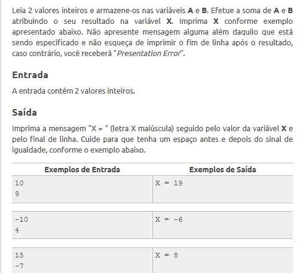
### Exercício 1002
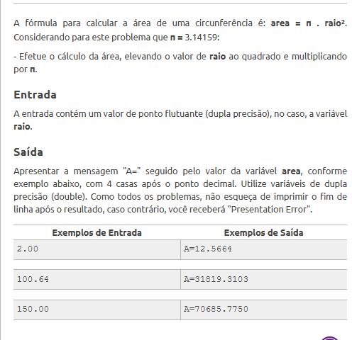
### Exercício 1003
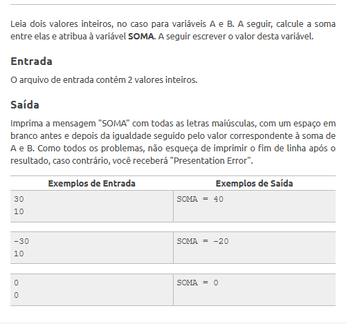
### Exercício 1003
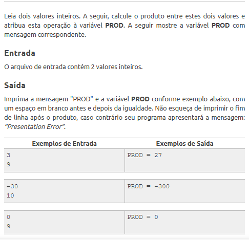
### Exercício 1005
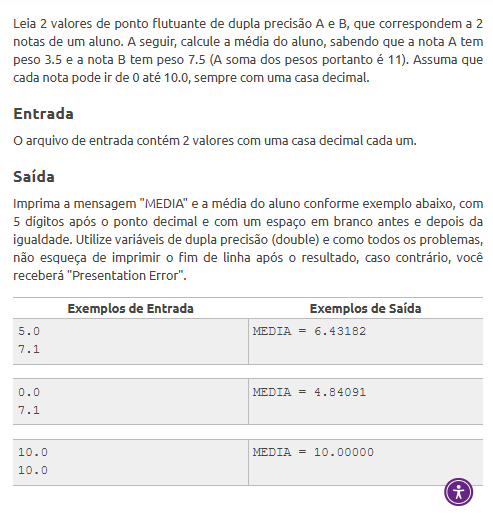
### Exercício 1006
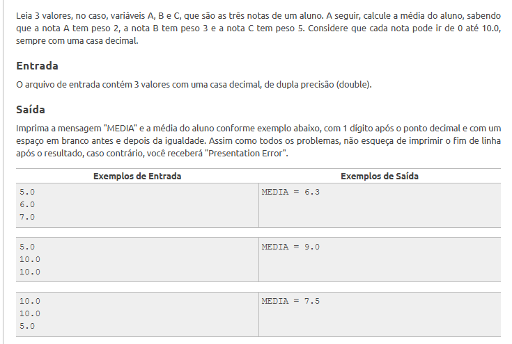
### Exercício 1007
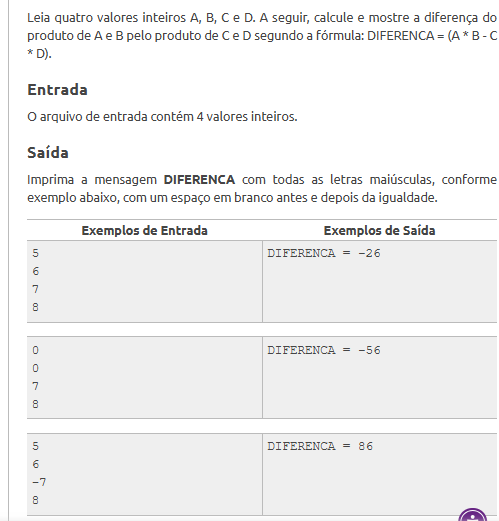
### Exercício 1008
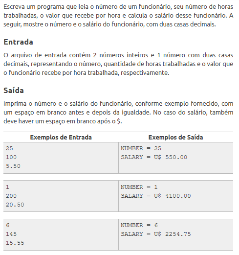
### Exercício 1009
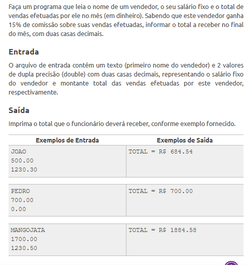
### Exercício 1010

### Exercício 1011
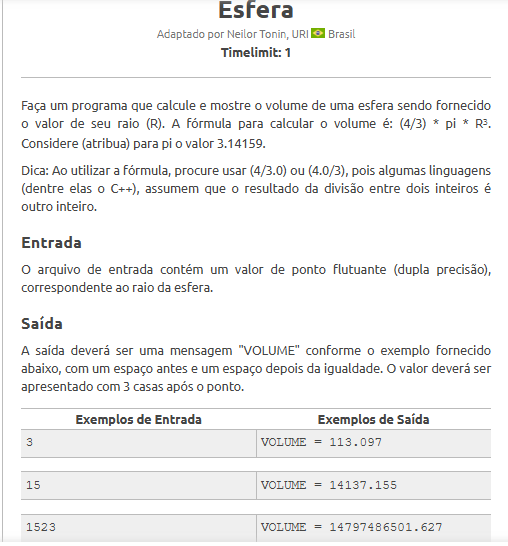
### Exercício 1012
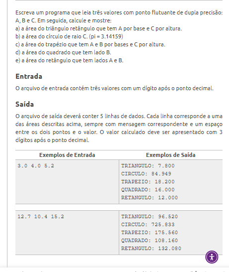
